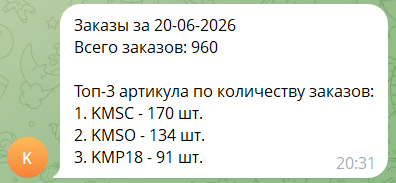

# WB Orders Bot

Скрипт забирает заказы WB за вчерашний день, сохраняет их в CSV и шлёт в Telegram топ-3 артикула по количеству заказов.

## Запуск

```bash
git clone https://github.com/alexmustdie/wb-orders-bot.git
cd wb-orders-bot
pip install -r requirements.txt
cp .env.example .env
```

Заполняем `.env`:

```
WB_API_TOKEN=...
TELEGRAM_BOT_TOKEN=...
TELEGRAM_CHAT_ID=...
```

Запускаем:

```bash
python main.py
```

## Формат сообщения в Telegram



## Про хранилище

Перешёл бы на Postgres. Google Sheets хорош для ручной работы с небольшими таблицами, но на 100к+ строк он еле живой, также сталкнёмся с лимитом в 10 млн ячеек на файл. Postgres решает обе проблемы: выборки за период работают через индексы независимо от того, сколько всего накопилось + схема не даст записать туда что попало.

## Что доделал бы для прода

- Тесты
- Ретраи на сетевые ошибки (с учётом лимитов WB)
- Нормальное логирование вместо print
- Запуск по расписанию, а не руками
